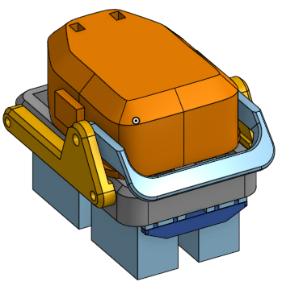
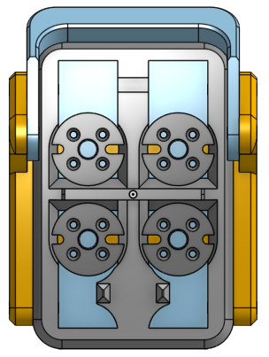
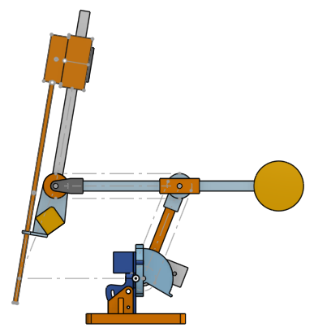

# da Vinci Gripper Controller

Arduino firmware for driving a da Vinci–style surgical gripper wrist with a
**Wemos D1 mini (ESP8266)** and a **PCA9685** 16-channel PWM/servo driver.
The main sketch hosts a small WiFi web app with sliders to control the wrist
and jaws from a phone or laptop.

## Mechanical design (CAD)

 

The gripper mount is designed in Onshape:
**[Onshape document — gripper mount](https://cad.onshape.com/documents/358ff1c0a006d7d34f0976ca/w/5407c1ceec2ad6f4e7318f8d/e/27201691492a085cdc850b61?renderMode=0&uiState=6a4214acfa5e5c9ed559e53d)**

## Hardware

- Wemos D1 mini (ESP8266)
- PCA9685 16-channel PWM driver (I²C address `0x40`)
- 4 hobby servos on PCA9685 outputs 12–15
- 5 V supply for the servos (the PCA9685 V+ rail), common ground with the D1 mini

### Wiring

| Wemos D1 mini | PCA9685 |
|---------------|---------|
| D2 (GPIO4)    | SDA     |
| D1 (GPIO5)    | SCL     |
| 3V3           | VCC     |
| GND           | GND     |

Servos connect to PCA9685 channels 12–15; power the servo rail (V+) from a
suitable 5 V source.

## Firmware

The firmware lives in [`pca9685_webserver/`](pca9685_webserver/) — a WiFi web
server that hosts the slider UI and drives the servos. See [Setup](#setup) to
build and flash it.

## Channel map & control scheme (`pca9685_webserver`)

| Channel | Function | Control |
|---------|----------|---------|
| 12 | Roll | direct |
| 15 | Wrist Pitch | direct |
| 13 | Left Jaw | mixed |
| 14 | Right Jaw | mixed |

The two jaw servos are driven by a **differential mix** rather than directly:

- **Wrist Yaw** — common (base) value for both jaws
- **Jaw Open** — differential value between the jaws

```
ch13 (Left Jaw)  = yaw + open
ch14 (Right Jaw) = yaw - open
```

Additional behavior:

- **Offset-centered sliders** — Roll, Pitch and Yaw are commanded as signed
  offsets from neutral (`0` = center); `0` is sent to the servos at startup.
- **Pitch → Yaw coupling compensation** — moving wrist pitch off neutral biases
  the jaw base by `0.5 × pitch_offset` to cancel mechanical cross-coupling
  (`PITCH_YAW_COUPLING`).
- **Servo range** — 0.75–2.25 ms pulse (`PWM_MIN`/`PWM_MAX`); jaw spread can go
  slightly negative (`OPEN_MIN`) so the jaws can over-close.
- **Reset button** — returns Roll/Pitch/Yaw to neutral and jaws to minimum spread.
- **mDNS** — reachable at `http://gripper.local/` (configurable via `MDNS_HOST`).

Key tuning constants live at the top of `pca9685_webserver/pca9685_webserver.ino`.

## Setup

1. **WiFi credentials.** The web server sketch reads them from a gitignored
   `secrets.h`. Create it from the template:

   ```sh
   cp pca9685_webserver/secrets.h.example pca9685_webserver/secrets.h
   # then edit secrets.h with your SSID and password
   ```

2. **Install the ESP8266 core** (once):

   ```sh
   arduino-cli core install esp8266:esp8266
   ```

3. **Build & upload** (adjust the serial port for your machine):

   ```sh
   arduino-cli compile --fqbn esp8266:esp8266:d1_mini pca9685_webserver
   arduino-cli upload  --fqbn esp8266:esp8266:d1_mini -p /dev/cu.usbserial-XXXX pca9685_webserver
   ```

4. Open the Serial Monitor at **9600 baud** to see the assigned IP address, then
   browse to `http://gripper.local/` (or that IP).

## Open work items / contributing

Contributions are welcome — open an issue or a pull request for new mounts,
firmware features, or documentation.

### Wanted: a PSM-style remote-center-of-motion (RCM) mount

Help wanted to design a mount that mimics the design choices of the da Vinci
**Patient Side Manipulator (PSM)** — adding **3+ degrees of freedom** with a
**remote center of motion (RCM)** at a cannula. An RCM mechanism pivots the
instrument about a fixed point in space (the cannula / entry port), so the tool
can pitch, yaw, and insert through a small opening without moving that entry
point.

This is not strictly necessary for all types of manipulation, but it takes
advantage of the long gripper design to work in small, constrained spaces
(e.g., reaching through a narrow port).

**Drivetrain direction (aspirational).** The Onshape starting point aspires to
drive the joints with **capstan drives**, inspired by
[Aaed Musa's work](https://www.youtube.com/watch?v=MwIBTbumd1Q). Capstan drives
look appealing here because the joint rotational axes need only a limited range
of motion, require reasonably high torque, and have the potential to keep the
part count low while lowering the mass of both the actuators and the arm. This
is not a requirement — it was just the direction I was hoping to try.

**References:**

- da Vinci PSM (Si) — reference geometry and labeling, from the
  [dVRK documentation](https://dvrk.readthedocs.io/):

  

- A very crude Onshape starting point (WIP) —
  [open in Onshape](https://cad.onshape.com/documents/a3ec289cccf8708e735107ff/w/74646be029774eebe42ef8fe/e/347869fce4c2d85b4819669a?renderMode=0&uiState=6a4217cf8db66ff7a59e2012):

  

If you'd like to take this on, open an issue to coordinate.

## Acknowledgements

- Bennett Stirton's [YouTube video](https://www.youtube.com/watch?v=d_8rHKrwr-Q)
  for some initial thoughts on how to approach this.

## License

[Apache License 2.0](LICENSE) © 2026 Johnny Lee
